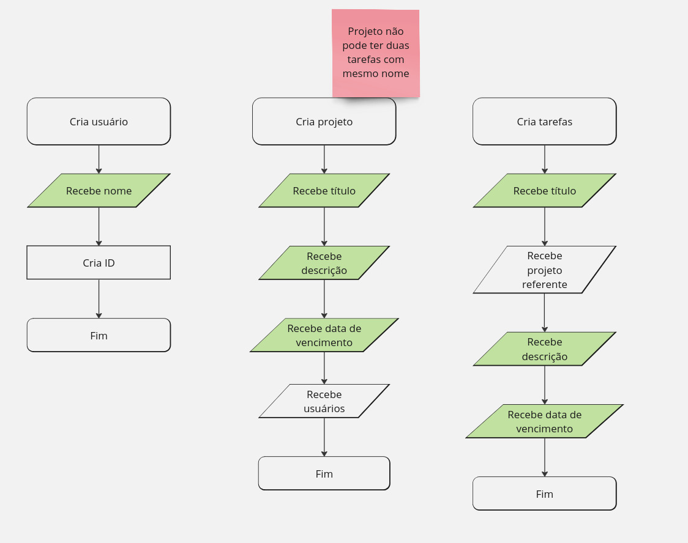
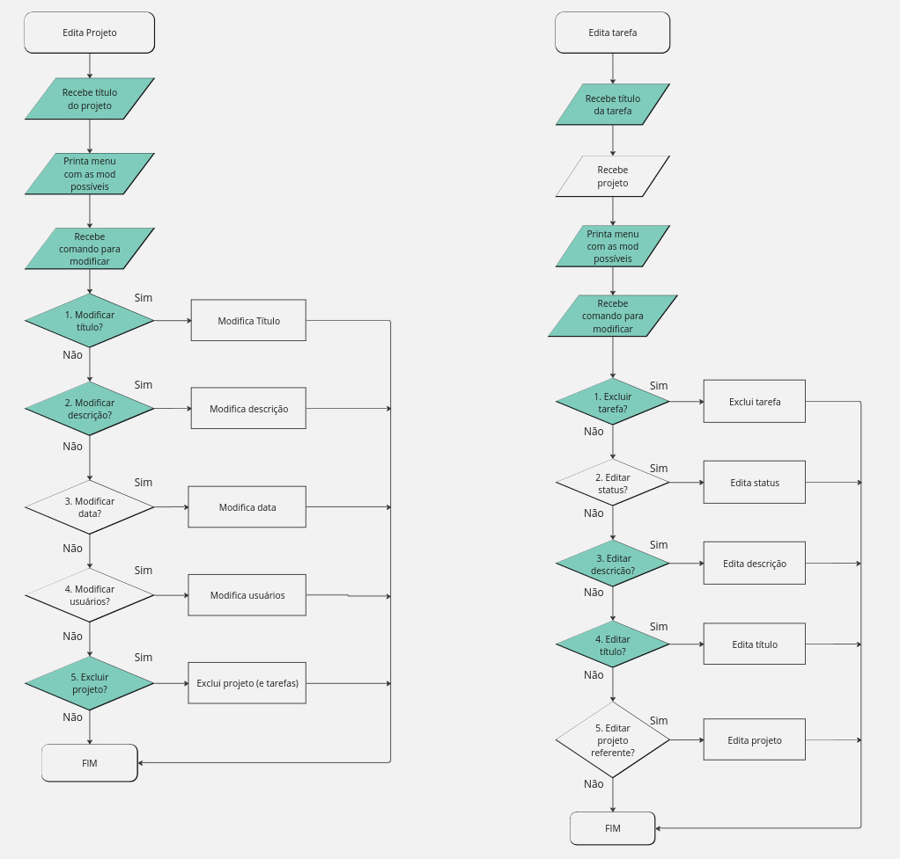
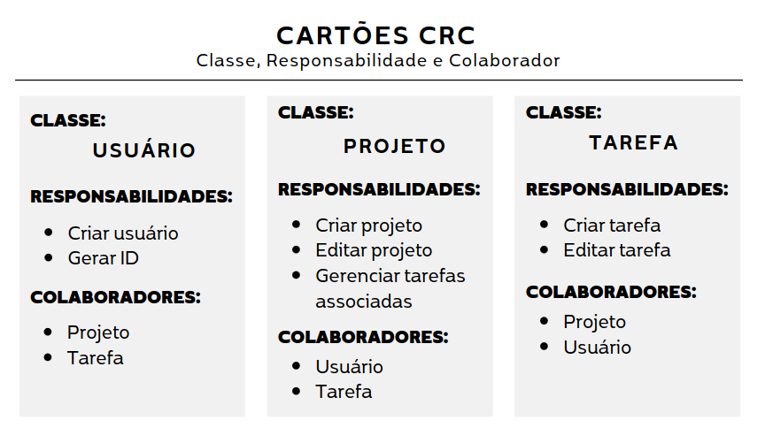
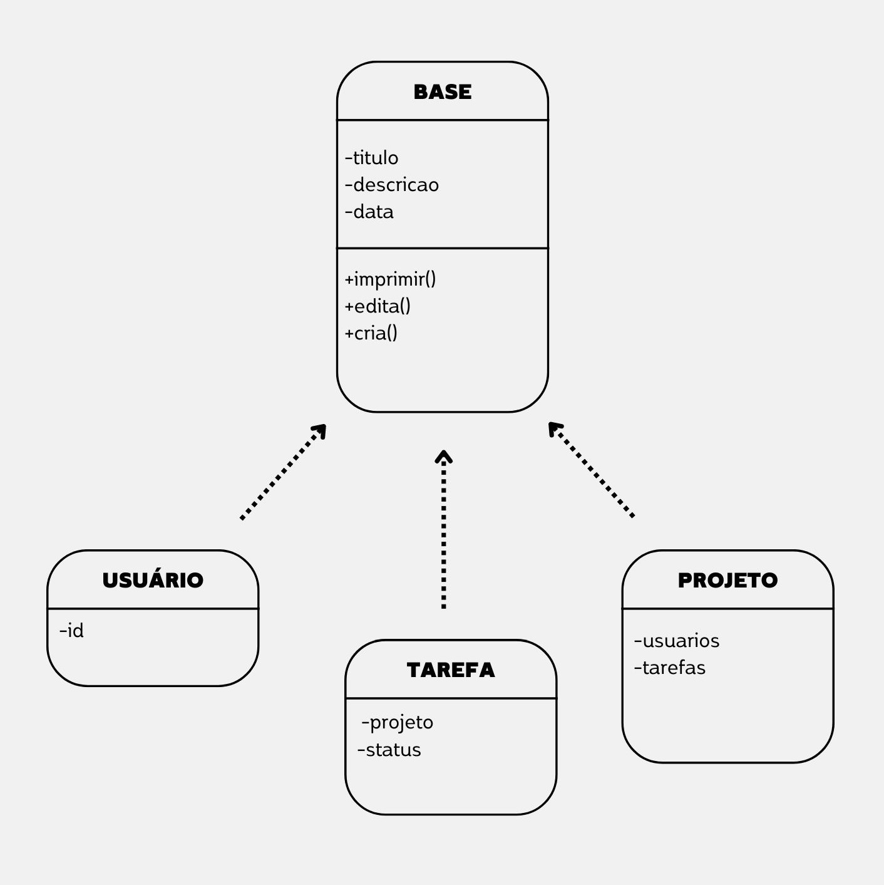

# Trabalho final Programação e Desenvolvimento de Software 

# Descrição geral do projeto:
Desenvolvimento de um Sistema de Gerenciamento de Projetos que permite a criação, edição e monitoramento de projetos e suas respectivas tarefas. Este sistema visa otimizar a organização e a execução de projetos, proporcionando uma interface intuitiva e funcional para o gerenciamento de atividades, prazos e responsabilidades.

## User story:
### Sistema de Gerenciamento de Projetos (Estilo Trello/Notion)
#### Descrição:
Como usuário, desejo poder criar, organizar e gerenciar projetos e
tarefas de forma eficiente e descomplicada.

#### Critérios de Aceitação:
- Posso formar uma lista de tarefas referente ao projeto.
- Posso criar e excluir tarefas individualmente.
- Posso organizar minhas tarefas de maneira personalizada, adicionando informações de título, descrição, status e data de vencimento.
- Posso gerenciar projetos, adicionando informações para que possam ser complementados a cada modificação.
- Posso atualizar o status das tarefas e atribuir responsáveis a cada uma.

# Visão geral da solução
### Funcionamento
O programa inicia com um menu principal que apresenta ao usuário as funcionalidades disponíveis. Cada opção é representada por um número, e o usuário deve digitar o número correspondente à ação que deseja realizar. Algumas funcionalidades podem não estar disponíveis em determinadas situações. Por exemplo, a opção "Listar Tarefas" não exibirá tarefas se nenhuma estiver cadastrada. Nesses casos, uma mensagem de aviso será exibida, e o programa retornará ao menu inicial.

### Funcionalidades: 
- Listar Tarefas: Exibe todas as tarefas cadastradas, juntamente com seus respectivos atributos, independentemente do projeto ao qual pertencem.

- Listar Projetos: Exibe todos os projetos cadastrados e seus respectivos atributos, incluindo os nomes de todas as tarefas associadas a cada projeto.

- Criar Tarefa e Criar Projeto: Solicita ao usuário as informações necessárias para criar um novo projeto ou tarefa, guiando-o pelo processo de entrada de dados.

- Editar Tarefa ou Editar Projeto: Abre um submenu com as opções de modificações disponíveis. Cada modificação é representada por um número, e o usuário deve escolher a opção desejada para realizar a alteração necessária.

### Exemplo de funcionamento:
--- Gerenciador de Projetos --- \
1.Criar Tarefa \
2.Listar Tarefas \
3.Criar Projeto \
4.Listar Projetos \
5.Editar Tarefa \
6.Editar Projeto \
7.Sair \
Digite sua opção: 3 

Insira o Título: PROJETO01 \
Insira a Descrição: Teste \
Insira a Data de vencimento: 22/08/24

--- Gerenciador de Projetos --- \
1.Criar Tarefa \
2.Listar Tarefas \
3.Criar Projeto \
4.Listar Projetos \
5.Editar Tarefa \
6.Editar Projeto \
7.Sair \
Digite sua opção: 1

Insira o Título: TAREFA01 \
Insira a Descrição: Teste2 \
Insira o Status: Em andamento \
Insira o Número do projeto: 1 

--- Gerenciador de Projetos --- \
1.Criar Tarefa \
2.Listar Tarefas \
3.Criar Projeto \
4.Listar Projetos \
5.Editar Tarefa \
6.Editar Projeto \
7.Sair \
Digite sua opção: 2

Título: TAREFA01 \
Descrição: Teste2 \
Status: Em andamento \
Projeto: PROJETO01

> No exemplo apresentado, o usuário criou um projeto e uma tarefa relacionada a esse projeto. É importante ressaltar que, ao criar um projeto, ele recebe um número, que será utilizado para referenciá-lo quando uma tarefa for criada.

> Observações: Se não houver projetos correspondentes ao número digitado pelo usuário, o programa exibirá um aviso, e a tarefa será registrada sem um projeto associado. Isso poderá ser alterado posteriormente na opção "Editar Tarefa".

## Fluxograma
#### Método cria:
 

#### Método edita:

## Cartões CRC

## Relação entre as classes

# Dificuldades
O método imprimir deve ser herdado da classe Base para as classes projeto e tarefas. Esse método deve apresentar um comportamento padrão: imprimir o título e a descrição, que são atributos comuns entre as classes projeto e tarefas. No entanto, há uma dificuldade em manter a sincronia durante a impressão em um loop. Especificamente, quando o método é especializado dentro da classe filha, o programa primeiro imprime os atributos genéricos e, em seguida, os atributos específicos. Isso resulta em uma falta de sincronia na saída. 